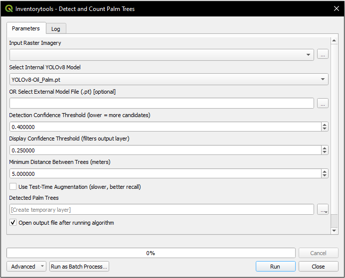
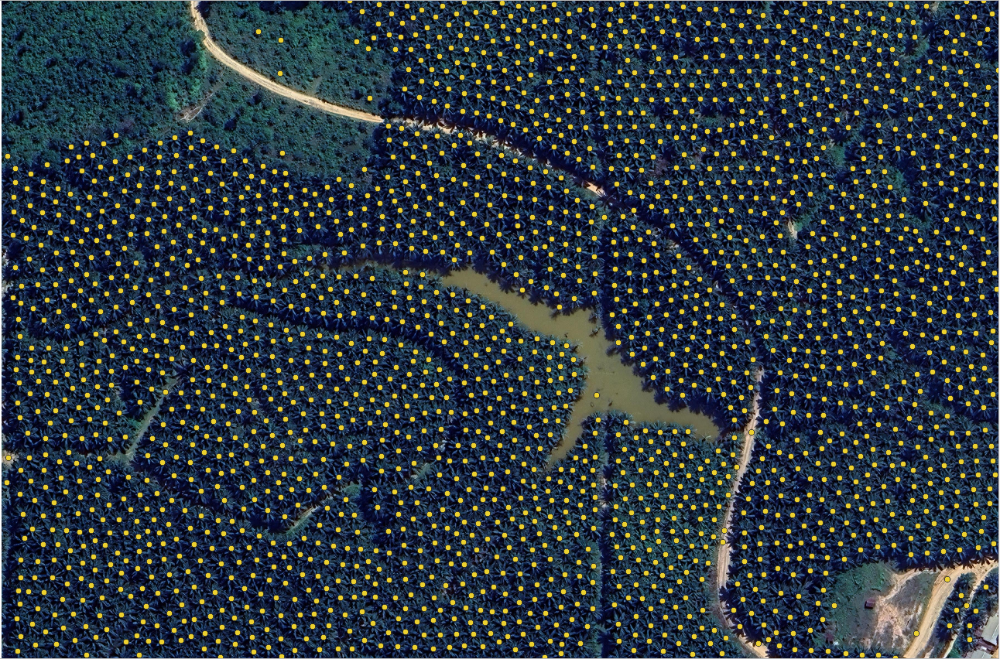
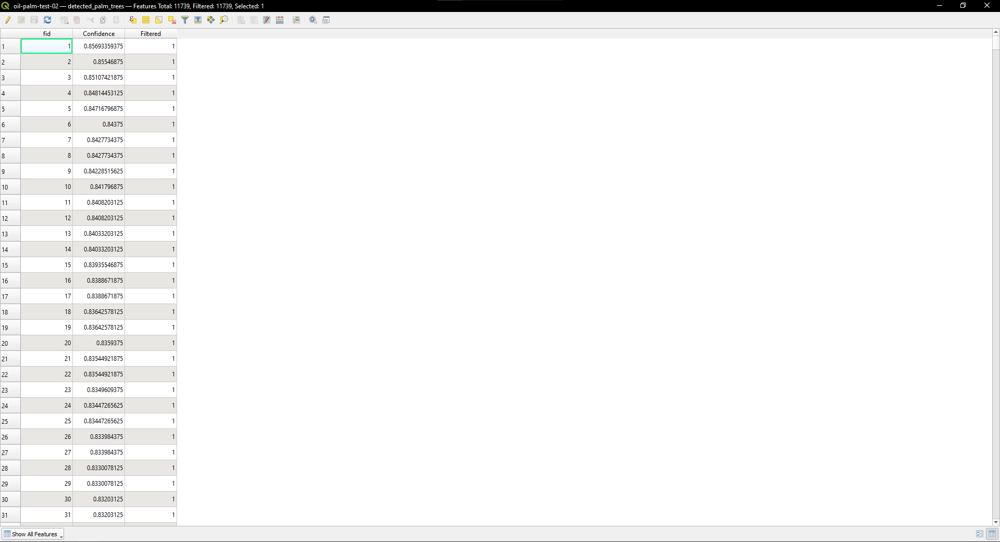

# SawitMetric

### Deep Learning-Based Oil Palm Detection & Counting for QGIS

SawitMetric is a QGIS-native deep learning plugin for automated oil palm canopy detection and inventory mapping using modern YOLOv8-based object detection workflows.

Built as both a research-oriented and operational geospatial analysis tool, SawitMetric integrates computer vision directly into the QGIS Processing Toolbox, enabling large-scale plantation inventory analysis without requiring external GIS export pipelines.

The plugin modernizes and extends the overlapping tile-processing methodology introduced by the [OPTIMAL-IPB framework](https://github.com/p4wlppmipb/OPTIMAL-IPB) by replacing the original RetinaNet + TensorFlow architecture with a streamlined YOLOv8 + PyTorch inference pipeline and CRS-aware geospatial postprocessing system.

---

# Key Features

* Native QGIS Processing Toolbox integration
* YOLOv8-based deep learning inference engine
* Overlapping tile matrix processing for large orthomosaics
* CRS-aware geodesic spatial deduplication
* Dynamic `.pt` model loading system
* CUDA GPU acceleration support
* Persistent execution logging framework
* Large raster processing support
* Standalone local inference without external servers

---

# Visual Demonstration







---

# Research Context

Oil palm inventory analysis is traditionally performed through manual interpretation workflows that are time-consuming, repetitive, and difficult to scale across large plantation environments.

SawitMetric was developed as a research-driven geospatial deep learning framework to automate oil palm detection directly within QGIS while preserving spatial integrity, reproducibility, and operational usability.

The plugin combines:

* Deep learning object detection
* Geospatial raster processing
* CRS-aware spatial analysis
* Persistent metadata logging

into a unified QGIS-native workflow.

---

# Relationship to OPTIMAL-IPB

SawitMetric is inspired by the overlapping tile-processing methodology introduced by the OPTIMAL-IPB framework developed by [P4W/CRESTPENT, IPB University](https://p4w.ipb.ac.id/).

However, SawitMetric is an independent implementation that substantially redesigns the inference and deployment architecture by introducing:

* YOLOv8 + PyTorch inference workflows
* Native QGIS geodesic spatial deduplication
* Persistent execution logging
* Dynamic model management
* Simplified deployment architecture
* Improved operational integration with modern QGIS environments

The project focuses on bridging academic computer vision workflows with practical GIS deployment requirements.

---

# Why YOLOv8?

Compared to earlier RetinaNet-based implementations, YOLOv8 provides several operational advantages for large-scale plantation mapping workflows:

* Faster inference performance
* Simplified deployment pipeline
* Modern PyTorch ecosystem support
* Reduced TensorFlow dependency complexity
* Improved hardware acceleration support
* Better maintainability for future development

SawitMetric leverages these advantages to provide a more scalable and deployment-friendly oil palm detection framework inside QGIS.

---

# System Workflow

```text
Orthomosaic Raster
        ↓
Overlapping Tile Generator
        ↓
YOLOv8 Inference Engine
        ↓
Candidate Vector Generation
        ↓
CRS-Aware Spatial Deduplication
        ↓
Confidence Filtering
        ↓
Persistent Logging
        ↓
Final Vector Output
```

---

# Core Technical Highlights

## CRS-Aware Geodesic Deduplication

One of SawitMetric’s core features is its CRS-aware spatial deduplication system.

Instead of relying solely on simple Euclidean distance filtering, the plugin utilizes native QGIS spatial processing components including:

* `QgsSpatialIndex`
* `QgsDistanceArea`

This enables distance calculations using true geodesic measurements across both projected and geographic Coordinate Reference Systems (CRS), improving consistency and reducing duplicate detections generated from overlapping tile boundaries.

---

## Overlapping Tile Matrix Processing

Large orthomosaics are divided into overlapping image tiles during inference execution.

This approach helps:

* preserve edge targets
* reduce tile-boundary fragmentation
* improve canopy continuity detection
* support large raster processing without loading entire imagery into GPU memory

---

## Persistent Logging Framework

SawitMetric includes a multi-layer persistent logging system designed to improve reproducibility and execution tracking.

Processing information is stored through:

1. Layer metadata embedding
2. Sidecar summary files
3. QGIS Message Log integration

This preserves critical execution parameters such as:

* model weights used
* detection thresholds
* execution time
* hardware acceleration state
* detection statistics

---

# Recommended Input Imagery

SawitMetric is optimized for:

| Parameter   | Recommendation            |
| ----------- | ------------------------- |
| Raster Type | Orthomosaic               |
| Format      | GeoTIFF                   |
| Bands       | RGB                       |
| Resolution  | < 0.5 m/pixel recommended |
| Projection  | Any CRS supported by QGIS |

---

# System Requirements

## Minimum Requirements

| Component          | Requirement            |
| ------------------ | ---------------------- |
| OS                 | Windows 10/11 (64-bit) |
| QGIS               | 3.40+                  |
| RAM                | 8 GB                   |
| GPU                | Optional               |
| Python Environment | OSGeo4W                |

---

## Recommended Requirements

| Component | Recommendation          |
| --------- | ----------------------- |
| GPU       | NVIDIA CUDA-capable GPU |
| VRAM      | 4 GB or higher          |
| RAM       | 16 GB+                  |
| Storage   | SSD recommended         |

---

# Verified Dependency Versions

```text
numpy==1.26.4
torch==2.7.1+cu118
torchvision==0.22.1+cu118
ultralytics==8.4.49
```

---

# Quick Installation

## 1. Install QGIS

Install QGIS 3.40 or newer.

[PLACEHOLDER IMAGE: qgis_installation_page]

---

## 2. Open OSGeo4W Shell

Run the OSGeo4W Shell as Administrator.

[PLACEHOLDER IMAGE: osgeo4w_shell]

---

## 3. Install Dependencies

```cmd
python3 -m pip install "numpy<2.0" --force-reinstall
```

```cmd
python3 -m pip install torch torchvision --index-url https://download.pytorch.org/whl/cu118 --no-cache-dir --force-reinstall
```

```cmd
python3 -m pip install ultralytics
```

---

## 4. Verify CUDA Availability

Inside the QGIS Python Console:

```python
import torch

print(torch.cuda.is_available())
print(torch.cuda.get_device_name(0))
```

[PLACEHOLDER IMAGE: cuda_verification_console]

---

## 5. Install Plugin ZIP

Inside QGIS:

```text
Plugins
    → Manage and Install Plugins
        → Install from ZIP
```

[PLACEHOLDER IMAGE: install_plugin_zip]

---

# Model Weights Setup

Place YOLOv8 `.pt` model files inside the plugin `/models` directory.

Example:

```text
SawitMetric/
└── models/
    ├── sawit_yolov8n.pt
    └── sawit_yolov8s.pt
```

The plugin automatically scans and populates available model files during startup.

---

# Usage Workflow

## 1. Load Orthomosaic Raster

[PLACEHOLDER IMAGE: load_orthomosaic]

---

## 2. Open Processing Toolbox

```text
Processing Toolbox
    → Inventory Tools
        → Detect and Count Palm Trees
```

[PLACEHOLDER IMAGE: processing_toolbox]

---

## 3. Configure Parameters

| Parameter                | Description                           |
| ------------------------ | ------------------------------------- |
| Detection Confidence     | Initial candidate detection threshold |
| Display Confidence       | Final output filtering threshold      |
| Minimum Spacing Distance | Duplicate suppression distance        |
| Model Selection          | YOLOv8 weights selection              |

[PLACEHOLDER IMAGE: parameter_configuration]

---

## 4. Execute Detection

The plugin will:

* generate overlapping tiles
* run YOLOv8 inference
* perform spatial deduplication
* generate vector outputs
* store execution logs

[PLACEHOLDER IMAGE: detection_execution]

---

# Output Structure

SawitMetric generates vector detection layers containing:

| Field      | Description           |
| ---------- | --------------------- |
| id         | Detection identifier  |
| confidence | YOLO confidence score |
| model      | Weight file used      |
| timestamp  | Execution timestamp   |

[PLACEHOLDER IMAGE: output_attribute_table]

---

# Performance Notes

Performance depends heavily on:

* raster resolution
* GPU acceleration
* overlap stride
* VRAM capacity

Example benchmark:

| Raster Size      | GPU      | Processing Time |
| ---------------- | -------- | --------------- |
| 2 GB Orthomosaic | GTX 1650 | ~12 minutes     |

---

# Known Limitations

* Dense overlapping canopies may generate merged detections
* Very low-resolution imagery may reduce recall accuracy
* Heavy shadows may reduce confidence consistency
* Large rasters may require significant RAM and VRAM resources
* CPU-only inference may be substantially slower

---

# Troubleshooting

## CUDA Not Detected

Verify:

* NVIDIA drivers
* CUDA-compatible PyTorch installation
* correct `+cu118` wheel installation

---

## Empty Detection Output

Check:

* confidence threshold values
* raster resolution
* model weight compatibility

---

## Torch Import Failure

Reinstall compatible PyTorch wheels inside the OSGeo4W environment.

---

## QGIS Crash After Dependency Installation

Dependency mismatches inside OSGeo4W may corrupt the embedded Python environment.

It is recommended to:

* use verified versions only
* test inside secondary QGIS installations
* avoid upgrading unrelated QGIS Python libraries

---

# Future Development

Planned features include:

* ONNX runtime support
* segmentation-based canopy extraction
* Linux deployment support
* batch raster queue execution
* memory optimization improvements
* multi-class plantation analysis

---

# Documentation

Additional documentation:

* USER_GUIDE.md
* TECHNICAL_DOCUMENTATION.md
* CONTRIBUTING.md
* CHANGELOG.md

---

# License & Attribution

SawitMetric acknowledges the foundational spatial tiling methodology introduced by the OPTIMAL-IPB framework developed by P4W/CRESTPENT, IPB University.

SawitMetric is an independent implementation focused on modern YOLOv8-based inference workflows and native QGIS spatial processing integration.

Please refer to the project license for usage and redistribution details.

---

# Citation

```bibtex
[PLACEHOLDER CITATION]
```
